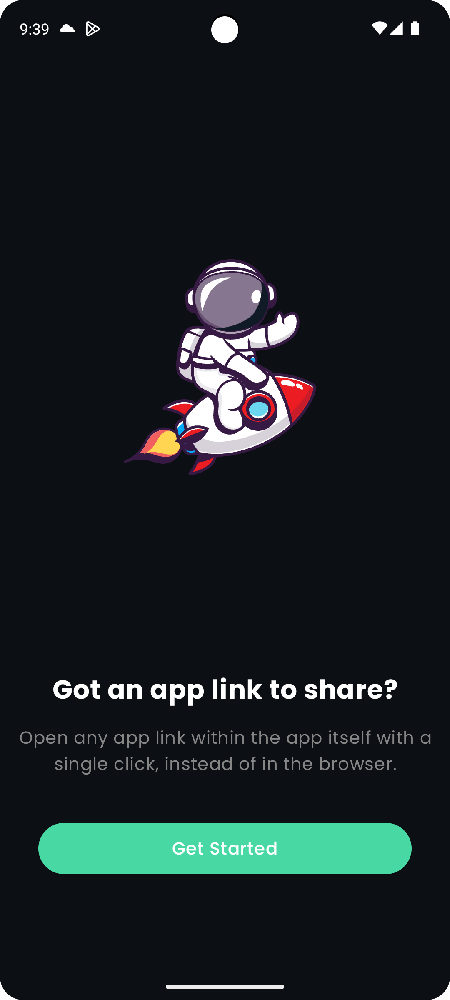
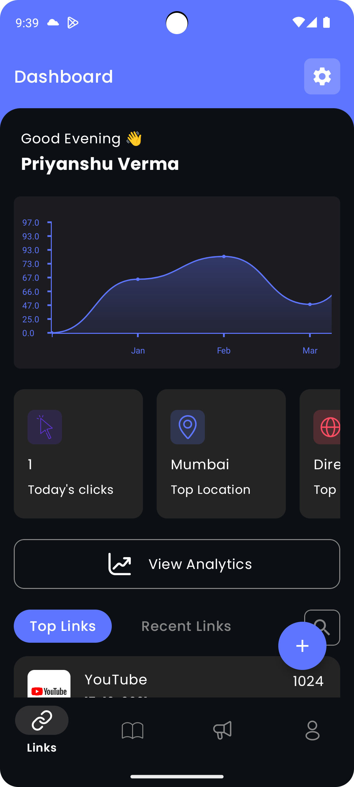

**OpenApp** 

[Watch App Overview Video](https://drive.google.com/file/d/1SkxX3I3ZMW0X62cNx1UJFwDZJHczUeEv/view?usp=sharing) 

[Download APK](https://drive.google.com/file/d/10ZAAtZmrMOannj5QMFz4v0l1H25EFG_0/view?usp=sharing)

## App Screenshots In Dark Mode

  &nbsp;&nbsp;&nbsp;
  &nbsp;&nbsp;&nbsp;
  &nbsp;&nbsp;&nbsp;
  &nbsp;&nbsp;&nbsp;
  &nbsp;&nbsp;&nbsp;
  &nbsp;&nbsp;&nbsp;

## App Screenshots In Light Mode

  &nbsp;&nbsp;&nbsp;
  &nbsp;&nbsp;&nbsp;
  &nbsp;&nbsp;&nbsp;
  &nbsp;&nbsp;&nbsp;
  &nbsp;&nbsp;&nbsp;
  &nbsp;&nbsp;&nbsp;

